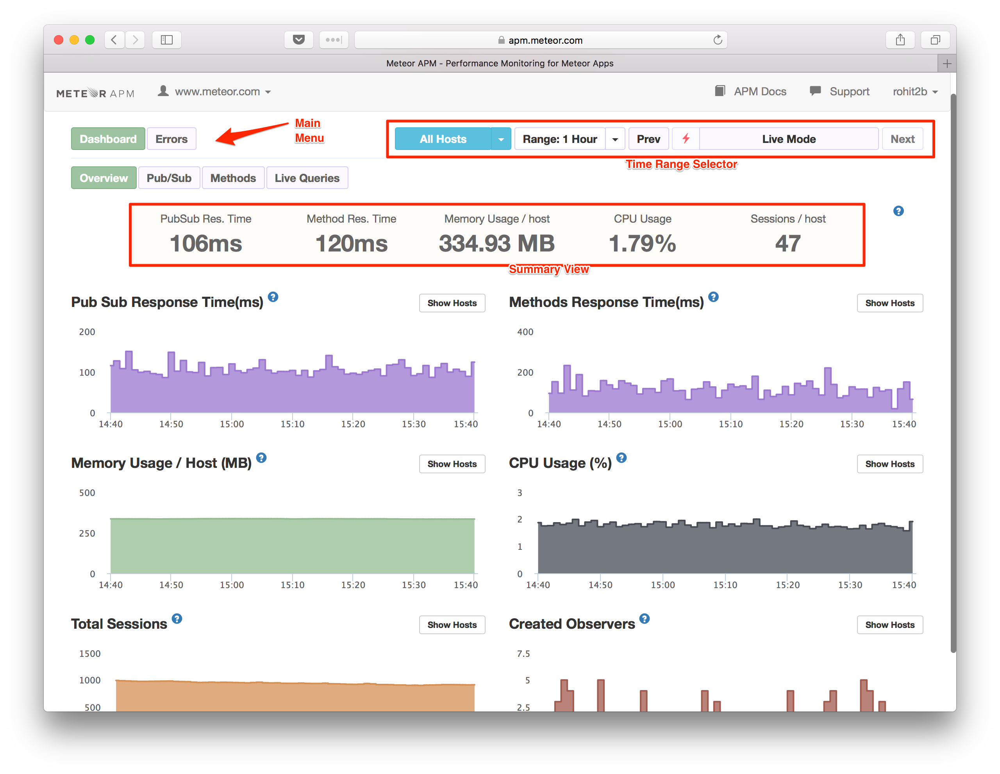

This guide will help you get started with Meteor APM, to better understand how your app behaves and identify areas for improvement.

## Install and Configure Meteor APM

1. Run `meteor add mdg:meteor-apm-agent` inside your Meteor project.
2. Once you have deployed your app, enable "Galaxy Professional" from the app settings page.

Now your app will send information to Meteor APM. Visit [Galaxy](https://galaxy.meteor.com) to find links to your APM dashboard.  Links can be found in the following places:

- In the *Performance* area on the App Overview & Containers pages.
- In the *Galaxy Professional* area on the App Settings page.

After a minute, data should begin appearing.

## Meteor APM Dashboard

This is the overview of the Meteor APM Dashboard.

The dashboard is meant to be self-explanatory, but if you'd like more information, watch our [Onboarding video](https://www.youtube.com/watch?v=GDkG2Wq3mLo).

## How to Use Meteor APM

While there is no right or wrong way to use Meteor APM, here are some common use cases.

### Finding Bottlenecks in Meteor Methods and Fixing Them

Normally, for a typical Meteor application, the Average Response Time of a Meteor Method should not be more than 200ms. If it exceeds this, you may be able to improve performance.

* First click on **Methods** on the Main Menu and look at the Response Time.
* Also look at the Response Time graph for any spikes.
* If you find places where the Response Time is higher than 200ms, click the **Detailed View** button on the Sub Menu.
* Then find the Response Time and click on the spike in the graph.
* This will show a set of traced methods at that time.
* Click on a trace to see exactly what has happened on that method at that time.
* Follow this [article](/apm-make-your-app-faster.md) to understand the traced data and improve your method accordingly.

<iframe width="640" height="480" src="https://www.youtube.com/embed/4vt2M7-bsDQ" frameborder="0" allowfullscreen="1">
</iframe>

> You can follow the [same process](https://www.youtube.com/watch?v=CQtmnzIlzE4&feature=youtu.be) for PubSub.

### Finding Methods You Need to Improve

In your app, you might be using many Meteor Methods. While you may need to improve all of them, it's good to start with the ones that have the most impact. We’ve determined that, if you can improve a method with higher Throughput, it will result in a total performance gain. To continue, follow these steps:

* Click on the **Detailed View** of Methods.
* Sort the Methods Breakdown by Throughput (the default sort criteria).
* Click on a method name in the Methods Breakdown. Assess the impact if you improve the selected method.
* Click on the Response Time Graph and find a trace.
* Try to make your app [faster](/apm-make-your-app-faster.html) and improve your method if possible.
* Do the same for all methods.

<iframe width="640" height="480" src="https://www.youtube.com/embed/REUrBU7x6GU" frameborder="0" allowfullscreen="1">
</iframe>

> You can follow the [same process](https://www.youtube.com/watch?v=CTk0Qvj0n6Y&feature=youtu.be) for PubSub, but you will need to sort the Pub/Sub Breakdown by SubRate instead of Throughput.
