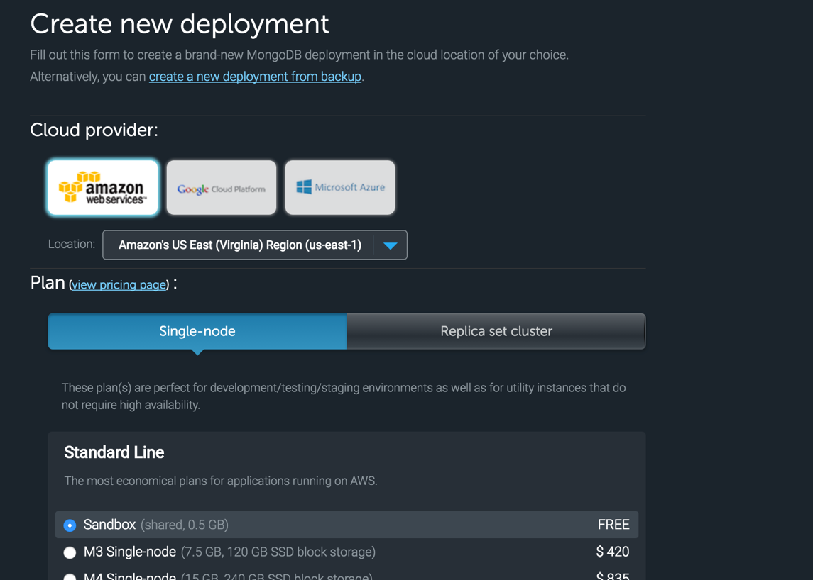
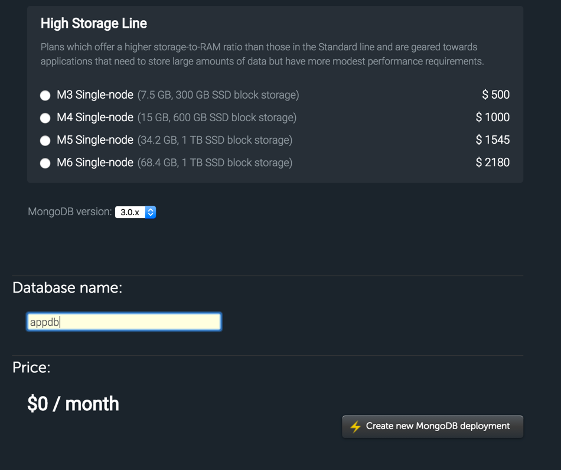
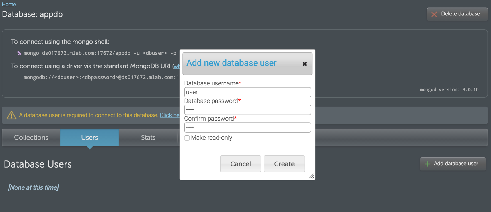
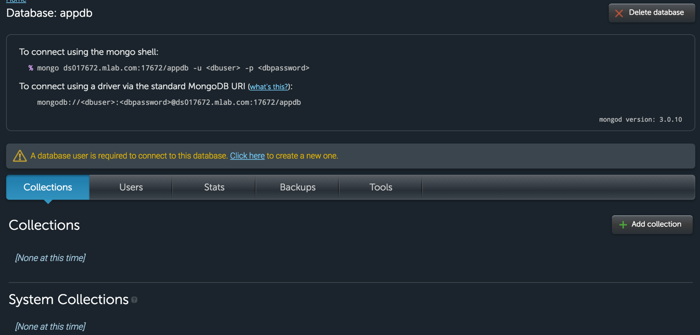
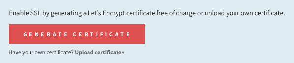

Galaxy makes it simple to deploy, scale, and monitor your Meteor application. This guide provides detailed step by step instructions for deploying your application to Galaxy.

This guide will cover:
- Setting up MongoDB
- Specifying Meteor application settings
- Setting the hostname
- Using the Meteor CLI tool to deploy the application
- Configuring domains and SSL Encryption for the application 

<h2 id="sign-up">Sign up for Galaxy</h2>
You will need a Galaxy account that your Meteor Development Account has deploy authorization for. 

[Sign up](https://www.meteor.com/galaxy/signup) here for a new Galaxy Account.

<h2 id="mongo-configure">Configure your MongoDB database</h2>

If your Meteor application has a package that requires Mongo, then you will need a Mongo database configured for your application. If you want to use a hosted database provider, We recommend that you provision it from one of these providers: [mLab](www.mlab.com) and [compose](www.compose.io).

<h3 id="">Configure a free Sandbox MongoDB database</h3>

mLab offers a free sandbox MongoDB database. The sandbox is a single node database that is good for non-production workloads. 

This sub-section will walk through creating a new sandbox database.  

Create an account on mLab. Within your mLab account, go to https://mlab.com/create and select the Sandbox option in the Single-node plan. 




Provide a name for the database and create the deployment.



The newly created database will be listed in your account. Select the database. 


Create a database user that will be used by your Meteor application to access the database. Do not select the option 'Read-only' for the user.



Note the MongoDB URI shown on the database page. You will use this URI with the username and password later to configure the connection to the database.



<h2 id="settings-create">Create a settings file for Galaxy</h2>

Create a Meteor settings file that will define the set of configurations needed for your application to deploy and run on Galaxy. At a minimum, the settings file needs to contain the connection URL to the MongoDB database.

In your application directory, create a file named settings.json. Put the Mongo URI in the file, with this format:

```
{
  "galaxy.meteor.com": { 
     "env": { 
       "MONGO_URL": "mongodb://<dbuser>:<dbpassword>@<dbserver>:<dbport>/<dbname>" 
     } 
   }
}
```

For a detailed example of the settings.json file, see [Environment Variables](/environment-variables.md).

<h2 id="select-hostname">Select a hostname</h2>

Choose a hostname that your application will be available to the public on. You can choose a custom domain or you can choose to use the included `meteorapp.com` domain.

If you have a custom domain name, then you need to point your DNS (in your registrar’s dashboard) to galaxy-ingress.meteor.com. More instructions on DNS configuration can be found [here](/mongodb).

<h2 id="galaxy-deploy">Deploy your application to Galaxy</h2>

Use the Meteor CLI tool to deploy the application to Galaxy. Make sure that you are signed into an authorized Meteor Developer Account that has access to deploy to Galaxy. Use the CLI command `meteor whoami` to verify which Meteor Developer Account you are signed into.

<h3 id="deploy-mac">Mac and Linux</h3>

On the command line, within your application's directory, type:
```
DEPLOY_HOSTNAME=galaxy.meteor.com meteor deploy [hostname] --settings path-to-settings.json
```

- `hostname` is the fully qualified domain name where you're planning to host your application (for example, 'www.facebook.com').
- `path-to-settings.json` is the path to your settings file (for example, './settings.json').

<h3 id="deploy-windows">Windows</h3>

If you are using Windows, the commands to deploy are slightly different. You need to set the environment variable first, then run the deployment command second (the syntax is the same as everything you'd put for meteor deploy). The commands will look like this:

```
$ SET DEPLOY_HOSTNAME=galaxy.meteor.com
$ meteor deploy [hostname] --settings path-to-settings.json
```

<h3 id="account-selection">Specify an account to deploy</h3>

Galaxy utilizes the following policy to select the account to deploy your application to:

1. If an application with the specified hostname already exists in an account, Galaxy deploys to the same account.
2. If it is a new application, Galaxy chooses the individual user account if it exists.
3. If it is a new application, and individual user account does not exist, Galaxy chooses the first Galaxy organization account that you are a member of.

If you are a member of two or more accounts, you can specify an owner username (available in Meteor 1.3) with `--owner [username]`.

```
DEPLOY_HOSTNAME=galaxy.meteor.com meteor deploy [hostname] --settings path-to-settings.json --owner [username]
```

Where `username` is the Galaxy account username the application should deploy into. You need to have deploy privileges to the account.  Note: this only applies for new applications, as any subsequent deploys will already be attached to an account and re-use the same account.


<h2 id="configure-app">Configure your application</h2>

The first thing you should do is verify that the deployment was successful. Check to see if the application is accessible by navigating to its URL. Then check the application logs in Galaxy at `galaxy.meteor.com/app/<app_name>/logs` to see if there are any errors that are affecting the deployment.

Once your application is successfully deployed, head on over to your [Galaxy dashboard](http://galaxy.meteor.com) to configure your application by adding a custom domain name and enabling SSL encryption.

Add a domain in your application’s settings and point your DNS to `galaxy-ingress.meteor.com`.


[Enable encryption](/encryption.html) to secure sensitive data by generating a free [Let’s Encrypt](https://letsencrypt.org) certificate or uploading your own custom certificate.



**Learn more**

- Based on the [deploy guide](http://coderchronicles.org/2016/03/15/deploying-a-meteor-app-to-galaxy/) by Anders Ramsay
- Read our [quickstart guide](/deploy-quickstart.html) for deploying applications
- Learn how to [deploy to a specific account](/deploy-guide.html#account-selection)
- Learn how to [transfer apps](/transfer-apps.html) between accounts
