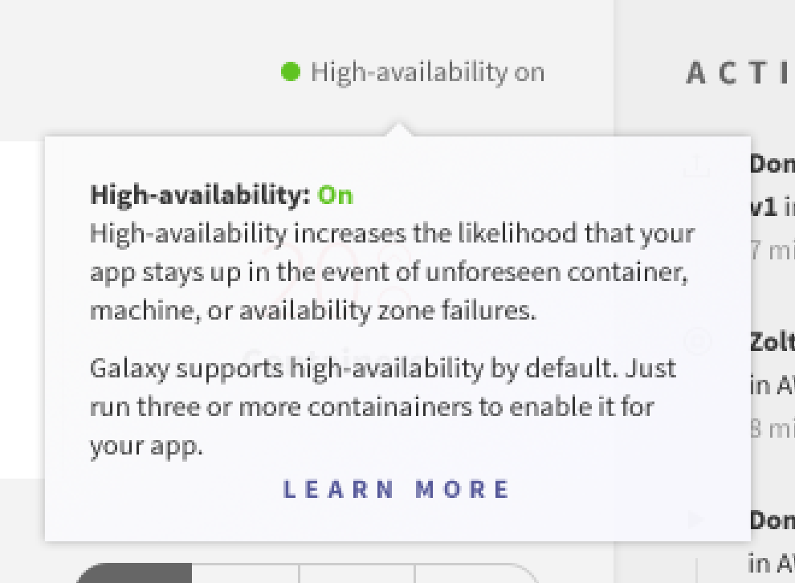

High-availability increases the likelihood that your app stays up in the event of unforeseen container, machine, or availability zone failures. We recommend high-availability for all business critical and production apps. Galaxy supports high-availability by default.  Just run three or more Standard containers to enable it for your app.

<h3 id="turn-on">Turn high-availability on</h3>

1. Check if your app has enabled high-availability on the app overview page 
2. Change the container size to Standard or larger in your app settings 
3. Add three or more containers on the app overview page 
4. Verify that it's enabled via the UI 

<h3 id="turn-on">How we do it</h3>

For deployments with three or more Standard containers, Galaxy will distribute an app's containers to a different availability zones in the same region. Dividing infrastructure across multiple data centers ensures that high-availability apps are fault tolerant.
