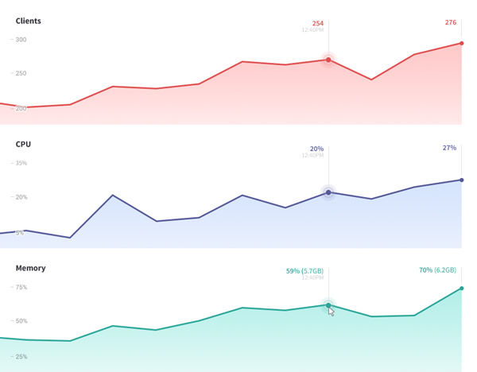
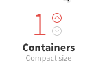

Scaling and sizing your application is specific to the architecture and performance characteristics of your app. As apps grow they often require more resources to perform well. Galaxy accommodates growth by offering vertical and horizontal resource scaling. Scaling with Galaxy happens without downtime so your users will not experience service interruption.

<h3 id="what-to-look-for">What to look for</h3>

We recommend that you scale when your app’s container usage exceeds either 70% memory, 80% CPU, or consistently spikes to 100% CPU. Use Galaxy’s performance graphs to track your resource usage over time.

<h3 id="how-to">How to scale</h3>

By default new applications are deployed to Compact containers. Compact containers are great for small apps. For large codebases we recommend that you run your app on Standard containers for best performance.

**Vertical scaling** increases your app's available resources by expanding the size of each container. Use this method of scaling when your app requires more CPU or RAM than the current container size can handle.

**Horizontal scaling** increases your app’s available resources by adding more containers. This is useful when sudden increases in usage or traffic cause your app to be less performant.

<h3 id="container-sizes">Container sizes</h3>

You can then change the container size for the application to any of the following:

- Compact: 512 MB/0.5 ECU
- Standard: 1 GB/1 ECU
- Double: 2 GB/2 ECU
- Quad: 4 GB/4 ECU
