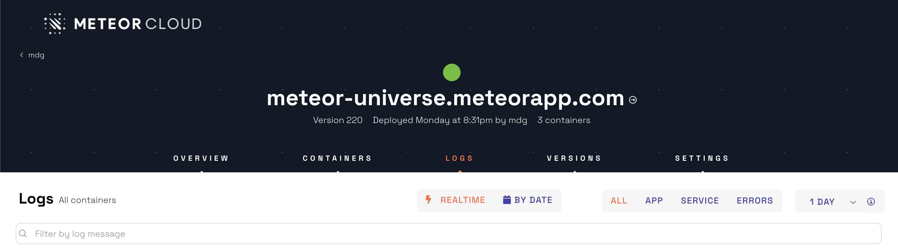
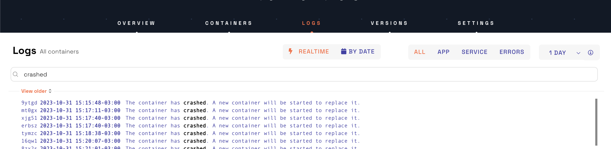
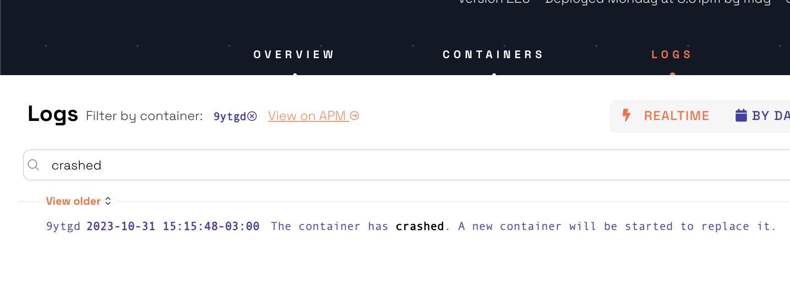
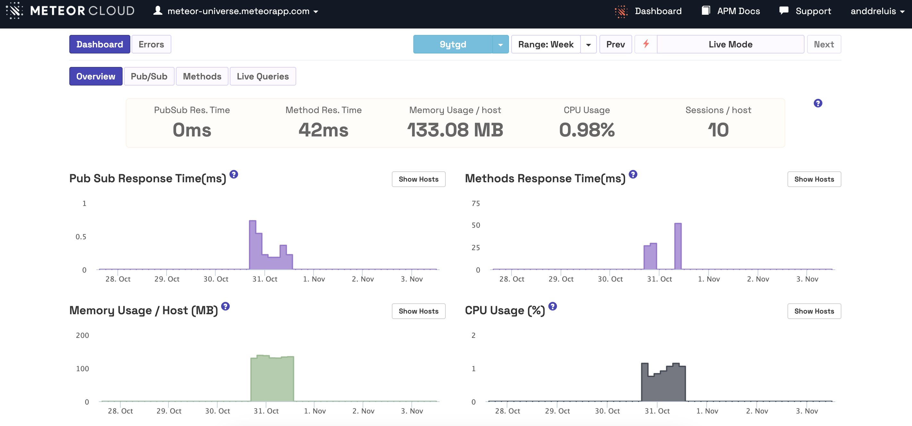

<h2 id="apm-data">How to view metrics for crashed/stopped containers</h2>

Viewing stopped and crashed containers can be helpful for troubleshooting problems with your applications. For example, if you are seeing errors in your application logs, you can view the logs of stopped and crashed containers to get more information about the cause of the errors.

To find the crashed or stopped containers on Galaxy, go to the Logs tab in your app:

Add crashed or stopped to filter and find the container ID:

Click on the container ID to view its logs. Then, click "View on APM" to see Meteor APM metrics.

Open Meteor APM and filter your hosts (containers) with the desired container ID:

Once you have identified the stopped or crashed container in Galaxy, you can use Meteor APM to view the container logs and troubleshoot the issue.
