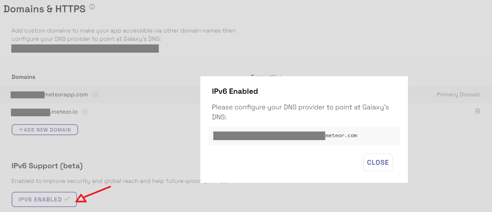

<!-- Note: post logger2 release, we'll also document the environment variables
     that we set, entry point, etc.
-->

Galaxy runs your app in a set of containers using the [Docker](https://www.docker.com/) container platform.

The actual code that is run is determined by the "base image" --- either the [default base image](/base-image-packages.html) or a [custom base image](/custom-base-images.html).

Galaxy runs your app on 64-bit Linux machines in the UTC time zone.

<h2 id="stopping-containers">How containers stop</h2>

When Galaxy wants to shut down your container (because you have deployed a new version, because you are scaling down, because Galaxy is replacing the underlying machine, or other reasons), it first sends the `SIGTERM` signal to your container, waits a grace period of 30 seconds, and then sends the `SIGKILL` signal.  If you'd like to do some cleanup work before your container dies, you can catch the `SIGTERM` signal (eg, with [`process.on('SIGTERM')`](https://nodejs.org/api/process.html#process_signal_events) in Node).  The `SIGKILL` signal cannot be caught; containers receiving this signal immediately die.  You can adjust the grace period on your app's settings page. Galaxy informs your app of how long the grace period will be via the `METEOR_SIGTERM_GRACE_PERIOD_SECONDS` environment variable.  If your app has many users, one thing you may wish to do during this grace period is close incoming connections gradually.  You can use our [`@meteorjs/ddp-graceful-shutdown`](https://www.npmjs.com/package/@meteorjs/ddp-graceful-shutdown) npm package (as described in [this blog post](https://blog.meteor.com/new-in-galaxy-gradual-client-transitions-during-deploys-fa78f4505df6)) to do this easily.

<h2 id="env-vars">Environment variables</h2>

Galaxy runs your app with the following environment variables set:

| Environment variable | Default value | meaning |
| -------------------- | ------------- | ------- |
| `APM_*` | Various | Galaxy Pro apps with Meteor APM enabled have several environment variables starting with `APM_` to configure their APM agent. |
| `GALAXY_APP_ID` | App identifier like `Ss8o4Y6KrvFBKKkqM` | Internal identifier for your app. |
| `GALAXY_APP_VERSION_ID` | Integer like `123` | The container's app version. |
| `GALAXY_CONTAINER_ID` | Container ID including app ID, like `Ss8o4Y6KrvFBKKkqM-3n28` | Internal identifier for this container. |
| `GALAXY_LOGGER` | `system` | For historical reasons, indicates to your container that log collection is handled by Galaxy. |
| `HTTP_FORWARDED_COUNT` | `1` | Tells your app that it is running behind a proxy. |
| `KADIRA_OPTIONS_HOSTNAME` | Short container ID, like `3n28` | For historical reasons, used to configure the third-party Kadira service on which Meteor APM is based. |
| `METEOR_SETTINGS` | A JSON object, set [when you deploy your app](/deploy-setup.html#settings-create) | Available as [`Meteor.settings`](https://docs.meteor.com/api/core.html#Meteor-settings). Galaxy may add fields to your settings object to enable features such as [prerender](/seo.html), and may reformat the JSON object. |
| `METEOR_SIGTERM_GRACE_PERIOD_SECONDS` | `30` | The length of the [container termination grace period](#stopping-containers). |
| `PORT` | Integer like `3000` | [Port on which your app should listen](#network-incoming). |
| `ROOT_URL` | Your app's default hostname, prefixed with `http://` or `https://` depending on whether you use Force HTTPS | Used by [`Meteor.absoluteUrl()`](https://docs.meteor.com/api/core.html#Meteor-absoluteUrl) to generate links. |

You can add your own environment variables and override any of these except for the container-specific ones (`GALAXY_CONTAINER_ID` and `KADIRA_OPTIONS_HOSTNAME`) and `GALAXY_LOGGER` [via your settings.json file](/deploy-setup.html#env-variables).

<h2 id="network">Network environment</h2>

<h3 id="network-incoming">Incoming connections</h3>

Galaxy runs your app containers in a firewalled network environment.  Only one port is exposed for external connections.  Galaxy tells your app what port to listen on via the `$PORT` environment variable, which contains a number such as `3000`.

Galaxy forwards HTTP connections (port 80) on your app's configured [domains](/custom-domains.html) to the port exposed for external connections. HTTPS connections (port 443) are also forwarded to this port if you've [configured encryption](/encryption.html).  You cannot serve connections on any other ports.

Galaxy does its best to stay up to date with current security protocol best practices, while still allowing our users to provide access to their sites to users with older browsers. We do currently support TLS 1.0 connections, which do have some known flaws. However, to the best our our knowledge, the main flaw in TLS 1.0 (the BEAST attack) can be thwarted with a proper server implementation, and our server implementation (based on the Go TLS library) [does so](https://github.com/golang/go/blob/5dc053b9/src/crypto/tls/conn.go#L895-L913). Dropping support for TLS 1.0 would break all users of MS Internet Explorer versions older than 11, which is a decision we're not ready to make for all of Galaxy's users.

If you cannot allow TLS 1.0 connections even with the Go BEAST mitigation, we do offer the option to configure it in an app-base manner:

- Go to Settings -> Security
- Select "Minimum 1.2" inside the "SSL TLS Protocol support" section

With this we will block every connection with TLS < 1.2.

<h3 id="network-outgoing">Outgoing connections and IP whitelisting</h3>

When your app connects to other services like your database, those services' connections will always appear to come from one of a fixed set of IP addresses.  These IP addresses are not the IP addresses of the individual machines your container runs on, so don't be surprised if they don't match.  (These addresses are distinct from the addresses that our "ingress" DNS address points to --- don't point your DNS there!)

Some services can be configured to only allow access from a list of IP addresses. Galaxy Professional customers can use these IP addresses in a "whitelist" on that service, for an extra layer of security. 

Whitelisting is especially common for databases and may be required by your database provider.

Note that whitelisted IP addresses are shared between all Galaxy Professional customers. While whitelisting is meant to protect your app from non-targeted attacks, you should still control access to your services by other means. 

To find the IP addresses you should be using, go to your app's Settings page and copy down the IP addresses shown there. If you haven't upgraded to Galaxy Professional containers yet, you'll need to at this point.

If your software wants you to specify your whitelist as a list of [CIDRs](https://en.wikipedia.org/wiki/Classless_Inter-Domain_Routing) rather than a list of IP addresses, just add the three characters `/32` to the end of each IP address.

<h3 id="ipv6-feature">Enable IPv6 for your apps</h3>

As the global pool of IPv4 space continues to shrink every day, organizations are deploying IPv6 at an ever-increasing pace. But sometimes it's just plain hard, especially when it requires a complete overhaul of your network.

When using Galaxy, we make it extremely easy to enable IPv6 for your apps, we can provide you with an IPv6 address and you can configure "DNS Pointing" in your DNS provider. 

Just go to your app settings and enable it as shown in the image below:

<h2 id="load-balancing">Health checking and load balancing</h2>

Galaxy expects that your container will provide an HTTP server listening on the port given in the `$PORT` environment variable. Galaxy expects that the HTTP server will respond to a `GET /` request with a well-formed HTTP response within 5 seconds. The health check sets a `User-Agent` header containing the string `Galaxybot/`. (Galaxy currently only validates that the response is a well-formed HTTP response, but it is a good idea to ensure that this response does not have a 5xx status code, as we may refine our definition of "healthy" in the future.)  If your container does not have a functional HTTP server listening on the given port, Galaxy will consider that container to be "unhealthy".

New client connections are routed to "least loaded" healthy containers. "Least loaded" is defined as the container with the fewest existing client connections.

If a container grows its memory or CPU usage, the existing client connections won't be re-routed, unless that container is marked as unhealthy. That is to say: Galaxy currently does not actively rebalance existing clients between healthy containers. If a container crashes or is marked unhealthy, its users will be routed to a healthy container.

If a new container stays unhealthy for 10 minutes, or a container that was once healthy becomes unhealthy and stays in that state for 5 minutes, Galaxy will replace it with a new container. Additionally, Galaxy will wait at least 10 minutes (longer for apps with many containers) for all containers of a newly deployed app version to become healthy before declaring the deploy a success, and will return to the previous active version on failure. You may disable all of the behaviors in this paragraph under "Unhealthy container replacement" on your app's settings page.

<h2 id="unhealthy">Unhealthy Containers</h2>

Your containers can be considered unhealthy if they don't respond Galaxy health check as expected ([read more here](#load-balancing)).

Since May 1st, 2020 Galaxy started to log in the service logs when one of your containers is unhealty, Galaxy also provides [notifications](./notifications.html) for these events.

It's important to understand that unhealthy containers are not a problem on Galaxy servers or unavailability of Galaxy. Unhealthy containers mean that your container is not able to respond to Galaxy health checks and this usually happens when your container is running with 100% CPU (or close to that) or using 100% of Memory (RAM), in both cases your container is not responding to Galaxy health check.

Many reasons can cause your containers to use all the available CPU or memory, sometimes the nature of the task that you are performing is just too heavy for the container size that you are using, so you need to increase your container size. Other times it's because your code is not capable of handle the quantity of connections that your app is receiving at the moment, in this case you need to increase the quantity of containers running.

> Tiny containers: this container size is design for hobby projects and open-source demos so you are probably going to get more unhealthy warnings if you are using this size.

Also, keep in mind that your code could also be improved to increase the capacity of your containers, in terms of CPU and Memory (RAM). It's very hard to estimate how much exactly each container size can handle because it depends more on your app code than of Node.js or Meteor itself.

One important tool to identify bottlenecks is the [Meteor APM](/apm-getting-started.html) as it shows to you the Methods and Publications running. Specially in cases where you have spikes in CPU usage keep an eye as well in background jobs ([read more](/background-jobs.html)), maybe they are consuming all your CPU and then your container becomes unhealthy. Node.js is single threaded so is very important to be aware of heavy CPU operations in your app, mainly if you run background job tasks in the same app your users use the UI. 

You can also profile your CPU as you would in any Node.js project, this [package](https://github.com/quavedev/profile) can help you to generate a profile and send it to S3. If your problem is related with memory you could use this [package](https://github.com/npvn/meteor-heapsave) to get heap dumps from your container. 

If you expect your container to be using all the 100% CPU a few times a day due to a heavy process or any other kind of process that cause your container to be unhealthy you can disable this notification. If your app can execute long tasks for more than 5 minutes you should also disable the `Unhealthy container replacement` otherwise Galaxy is going to replace the container.

Galaxy will also consider your app as unavailable if all your containers are unhealthy as the health checks will be failing for all containers.

<h3 id="unhealthy-replacement">Unhealthy Container Replacement</h3>

When automatic replacement of unhealthy containers is enabled:

- If a healthy container starts to fail health checks, it will be replaced after 5 minutes.
- New containers are given 10 minutes to become healthy before being replaced.
- Galaxy will wait at least 10 minutes (longer for apps with many containers) for all containers of a newly deployed app version to become healthy before declaring the deploy a success, and will return to the previous active version on failure.
