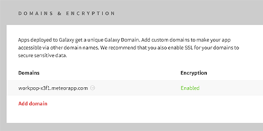
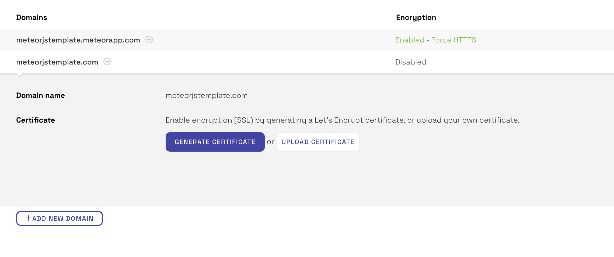

Galaxy makes it simple to deploy, scale, and monitor your Meteor app. This quickstart guide will walk new users through deploying your first app. It is the abridged version of the [comprehensive guide](/deploy-guide.html) aimed at developers who have experience deploying apps with remote databases.

<h2 id="get-ready-for-deploy">Get your app ready</h2>

The Free plan on Meteor Cloud allows you to get started and deploy applications on a pre-configured shared MongoDB instance. To deploy for free, simply enter this command in your terminal:
```
meteor deploy my-app --free --mongo
```

**Please note, free plans are not recommended for production applications. For production apps, you will need to configure your own MongoDB Database, outlined below:**

Before you begin deploying your app to production, [configure access to your MongoDB database](/mongodb.html) and set up any [environment variables](/environment-variables.html) your app depends on using your app’s settings.json file.

<h2 id="deploy-app">Deploy your app</h2>

The value of DEPLOY_HOSTNAME will depend on which region you are deploying to:

- To deploy to US East: DEPLOY_HOSTNAME=galaxy.meteor.com

- To deploy to EU West: DEPLOY_HOSTNAME=eu-west-1.galaxy.meteor.com

- To deploy to Asia-Pacific: DEPLOY_HOSTNAME=ap-southeast-2.galaxy.meteor.com

The region you deploy to will affect the URL of your dashboard. If your username is devname, you'll see your US East apps at https://galaxy.meteor.com/devname, your EU West apps at https://eu-west-1.galaxy.meteor.com/devname, and your Asia-Pacific apps at https://ap-southeast-2.galaxy.meteor.com/devname. 

<h3 id="deploy-mac">Mac and Linux</h3>

On the command line, within your app's directory, type:
```
DEPLOY_HOSTNAME=[region] meteor deploy [hostname] --settings [filepath.json]
```

- `region` is 'galaxy.meteor.com' for US East, 'eu-west-1.galaxy.meteor.com' for EU West, and 'ap-southeast-2.galaxy.meteor.com' for Asia-Pacific
- `hostname` is the fully qualified domain name where you're planning to host your application (for example, 'www.facebook.com').
- `filepath.json` is the path to your settings file (for example, './settings.json').


<h3 id="deploy-windows">Windows</h3>

If you are using Windows, the commands to deploy are slightly different. You need to set the environment variable first, then run the deployment command second (the syntax is the same as everything you'd put for meteor deploy).

In the case of US East, the commands would be:

```
$ SET DEPLOY_HOSTNAME=galaxy.meteor.com
```
```
$ meteor deploy [hostname] --settings path-to-settings.json
```

<h2 id="configure-app">Configure your app</h2>

Once your app is successfully deployed, head on over to the [US East](http://galaxy.meteor.com) dashboard; [EU West](http://eu-west-1.galaxy.meteor.com) dashboard or [Asia-Pacific](http://ap-southeast-2.galaxy.meteor.com) dashboard to configure your app by adding a custom domain name and enabling SSL encryption.

Add a domain in your app’s settings and point your DNS to `galaxy-ingress.meteor.com` for the US East region, `eu-west-1.galaxy-ingress.meteor.com` for the EU West region, or `ap-southeast-2.galaxy-ingress.meteor.com` for the Asia-Pacific region.



[Enable encryption](/encryption.html) to secure sensitive data by generating a free [Let’s Encrypt](https://letsencrypt.org) certificate or uploading your own custom certificate.



<h2 id="billing">How Billing Works</h2>

You're only billed when you have an app running. Keep running your app for as long as you want and pay-as-you-go at low metered rates. Simply “Stop” your app on the Settings page and billing will stop. Your app’s code and settings are preserved until you’re ready to run it again.

You can see your bills in your account's Settings page and read more about billing in our [billing](http://galaxy-guide.meteor.com/billing.html) article.

**Learn more**

- Read our [comprehensive guide](/deploy-guide.html) for deploying apps
- Learn how to [deploy to a specific account](/deploy-guide.html#account-selection)
- Learn how to [transfer apps](/transfer-apps.html) between accounts
