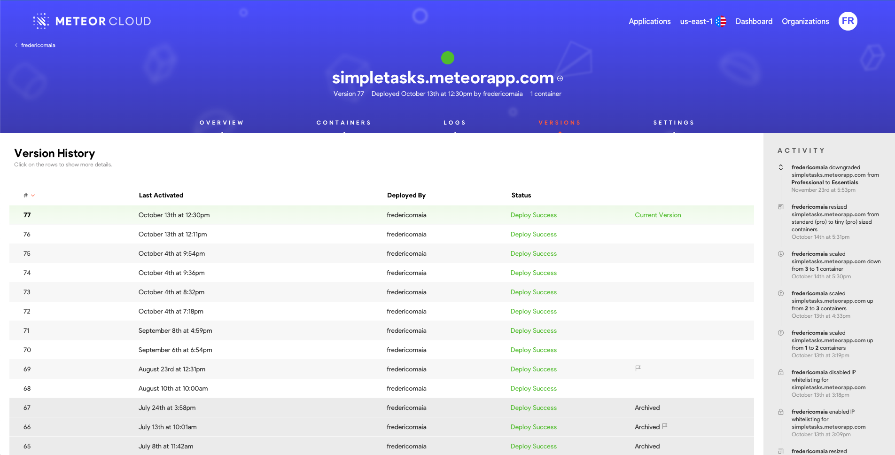
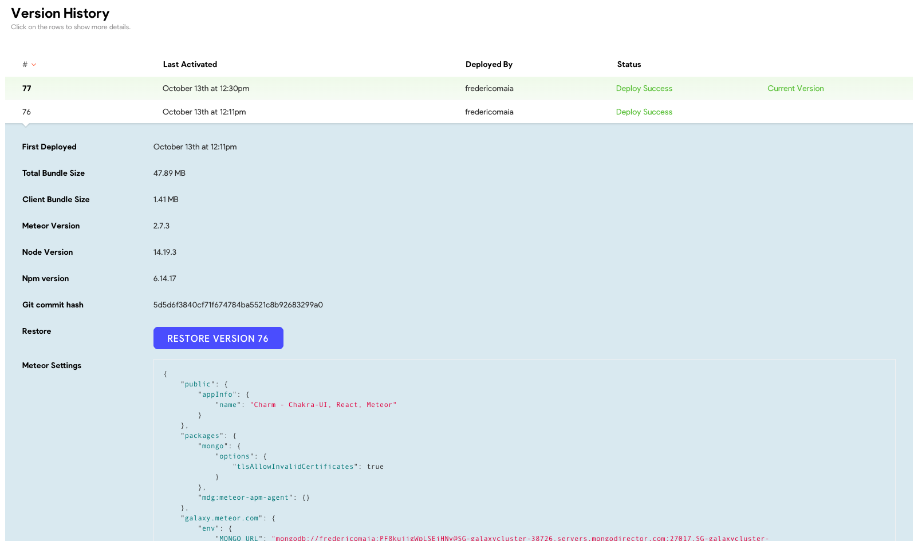
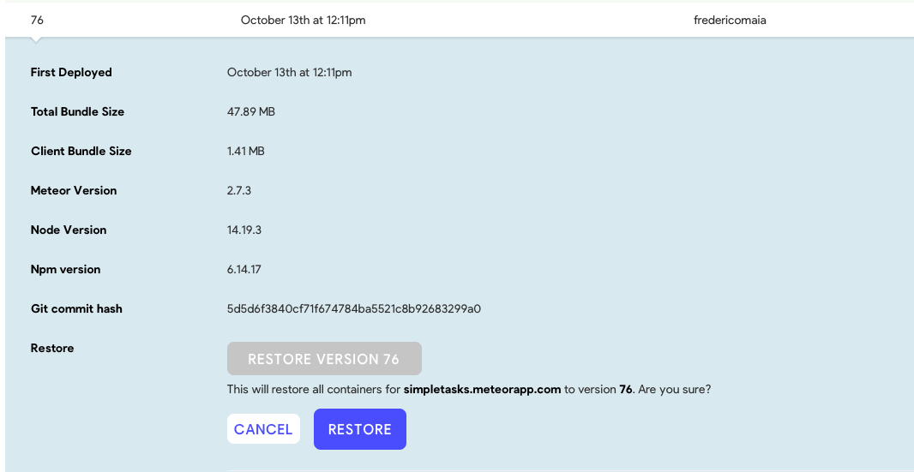
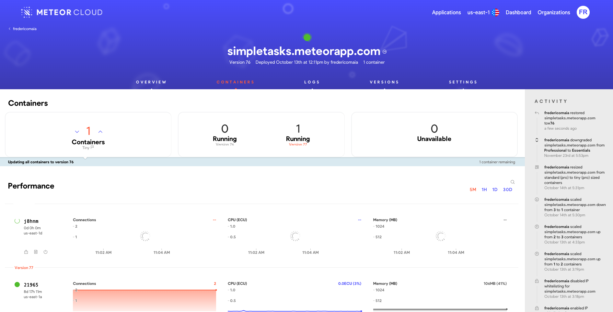
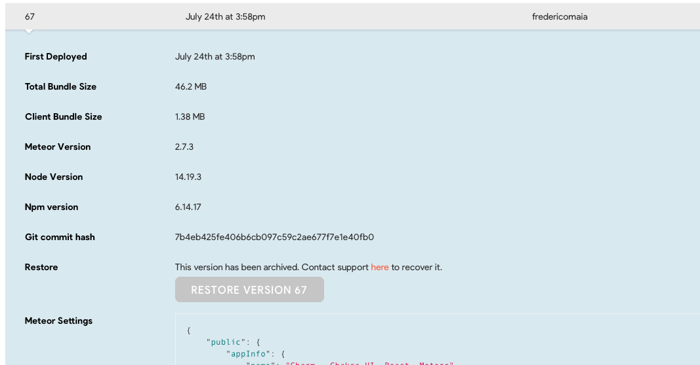

For a variety of reasons, you might need to recover from an incident in production — for example, due to a bug. In that case, Meteor Cloud allows you to restore your deployments and quickly revert back to a previously deployed production deployment.

<h2 id="how-to-rollback">How to roll back deployments?</h2>

1- From Galaxy, open the app to which you'd like to restore a deployment version.

2- Go to the `Versions` tab. From there, you can see your Version History with the version number, when it was activated, by who this version was deployed, its status, and which is the currently deployed version.

3- Click on the version row to show more details.

4- Click on `Restore Version {number}`, and confirm your selection by clicking on `Restore`.

5- Wait a few moments and your version will be restored. You can notice in the `Activity` panel that your version has been restored. And also notice in the `Containers` tab that your containers will be updated to the selected version.

<h2 id="archived-versions">Why there are archived versions?</h2>

You can instantly restore the last 10 versions. If you have more than 10 deployments, we will archive those deployed more than 30 days ago. You can still restore archived versions, just click the link right there next to the Restore button to ask our support to make this version available for you.

