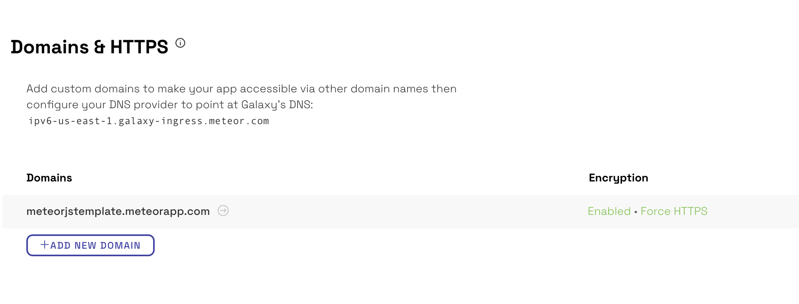

Galaxy makes it simple to deploy, scale, and monitor your Meteor application. This guide provides detailed step by step instructions for deploying your application to Galaxy.

This guide will cover:
- Setting up MongoDB
- Specifying Meteor application settings
- Setting the hostname
- Using the Meteor CLI tool to deploy the application
- Configuring domains and SSL Encryption for the application

<h2 id="mongo-configure">Configure your MongoDB database</h2>

If your Meteor application has a package that requires Mongo, then you'll need a Mongo database configured for your application. Most users will want to use a hosted database provider instead of running it yourselves, such as [MongoDB Atlas](https://www.mongodb.com/cloud/atlas) or [ScaleGrid](https://console.scalegrid.io/users/register?partnerID=meteor.com).

For optimum performance, we recommend that you setup a database in the same AWS region as your app deployment.

Many MongoDB providers expect you to tell them what IP addresses your app will be connecting from and forbids all connections from outside those addresses. To accomplish this on Galaxy, you'll need to [run your app in IP whitelisting mode](/container-environment.html#network-outgoing).

<h2 id="settings-create">Create a settings file for Galaxy</h2>

Create a Meteor settings file that will define the set of configurations needed for your application to deploy and run on Galaxy. At a minimum, the settings file needs to contain the connection URL to the MongoDB database.

In your application directory, create a file named settings.json. Put the Mongo URI in the file, using this format:

```
{
  "galaxy.meteor.com": {
     "env": {
       "MONGO_URL": "mongodb://<dbuser>:<dbpassword>@<dbserver>:<dbport>/<dbname>"
     }
   }
}
```

For a detailed example of the settings.json file, see [Environment Variables](/environment-variables.html).

<h2 id="select-hostname">Select a hostname</h2>

Choose a hostname that the public can use to access your application. You can use a custom domain or you can use the included *.meteorapp.com domain.

If you are using the included domain, use <hostname>.meteorapp.com for apps deployed to the US East region, <hostname>.eu.meteorapp.com for apps deployed to the EU West region or <hostname>.au.meteorapp.com for apps deployed to the Asia-Pacific region.

If you have a custom domain name, then you need to point your DNS (in your registrar’s dashboard) to galaxy-ingress.meteor.com. More instructions on DNS configuration can be found [here](/dns.html).

<h2 id="galaxy-deploy">Deploy your application to Galaxy</h2>

Use the Meteor CLI tool to deploy the application to Galaxy. Make sure that you are signed into an authorized Meteor Developer Account that has permission to deploy to Galaxy. Use the CLI command `meteor whoami` to verify which Meteor Developer Account you are signed into.

The value of DEPLOY_HOSTNAME will depend on which region you are deploying to:

- To deploy to US East: DEPLOY_HOSTNAME=galaxy.meteor.com

- To deploy to EU West: DEPLOY_HOSTNAME=eu-west-1.galaxy.meteor.com

- To deploy to Asia-Pacific: DEPLOY_HOSTNAME=ap-southeast-2.galaxy.meteor.com

<h3 id="deploy-mac">Mac and Linux</h3>

On the command line, within your application's directory, type:
```
DEPLOY_HOSTNAME=galaxy.meteor.com meteor deploy [hostname] --settings path-to-settings.json
```

- `hostname` is the fully qualified domain name where you're planning to host your application (for example, 'www.facebook.com').
- `path-to-settings.json` is the path to your settings file (for example, './settings.json').

<h3 id="deploy-windows">Windows</h3>

If you are using Windows, the commands to deploy are slightly different. You need to set the environment variable first, then run the deployment command second (the syntax is the same as everything you'd write for meteor deploy). The commands will look like this:

```
$ SET DEPLOY_HOSTNAME=galaxy.meteor.com
$ meteor deploy [hostname] --settings path-to-settings.json
```

<h3 id="cache-build">Cache your build</h3>

You can use the option `--cache-build` to reuse your build in multiple deploys.

This is useful if you want to deploy the same bundle to different environments and also if your upload is failing so you can just upload again without a new build.

The cache checks the current git commit of your repository so you need to be deploying from a folder that is a Git repository.

```
DEPLOY_HOSTNAME=galaxy.meteor.com meteor deploy [hostname] --settings path-to-settings.json --cache-build
```

> This was introduced on Meteor 1.11

<h3 id="cache-only">Build Only</h3>

You can use the option `--build-only` to stop the process after the build.

This is useful if you want to deploy the same bundle to different environments but first you want to build without deploying the bundle yet.

It's recommend to use this option with `--cache-build` so your bundle is not deleted after the process. If you want to just check if your build is working then you don't need to use `--cache-build`.

```
DEPLOY_HOSTNAME=galaxy.meteor.com meteor deploy --cache-build --build-only
```

> This was introduced on Meteor 2.3

<h3 id="account-selection">Specify an account to deploy</h3>

Galaxy utilizes the following policy to select the account to deploy your application to:

1. If an application with the specified hostname already exists in an account, Galaxy deploys to the same account.
2. If it is a new application, Galaxy chooses the individual user account if it exists.
3. If it is a new application, and individual user account does not exist, Galaxy chooses the first Galaxy organization account that you are a member of.

If you are a member of two or more accounts, you can specify an owner username (available in Meteor 1.3) with `--owner [username]`.

```
DEPLOY_HOSTNAME=galaxy.meteor.com meteor deploy [hostname] --settings path-to-settings.json --owner [username]
```

Where `username` is the Galaxy account username the application should deploy into. You need to have deploy privileges to the account.  Note: this only applies for new applications, as any subsequent deploys will already be attached to an account and re-use the same account.

<h3 id="deployment-token">Using a deployment token</h3>

Galaxy can also accept deployment tokens, which are good for 90 days. You can pass `METEOR_SESSION_FILE=token.json` before meteor login to generate a login session token so you don’t have to share your login credentials with third-party service providers. This solution is recommended for continuous integration service providers.

You can use a deployment token as an alternative to typing in your username and password. You'll need to specify it both when running `meteor login` on your machine to generate the file, and when actually running `meteor deploy` in CI. Please note that your organization choice does not affect your deployment token.

<h2 id="configure-app">Configure your application</h2>

The first thing you should do is verify that the deployment was successful. Check to see if the application is accessible by navigating to its URL. Then check the application logs in Galaxy at `galaxy.meteor.com/app/<app_name>/logs` to see if there are any errors that are affecting the deployment.

Once your application is successfully deployed, head on over to your [Galaxy dashboard](http://galaxy.meteor.com) to configure your application by adding a custom domain name and enabling SSL encryption.

Add a domain in your application’s settings and point your DNS to:

- `galaxy-ingress.meteor.com` for applications in the US East region.

- `eu-west-1.galaxy-ingress.meteor.com` for applications in the EU West region.

- `ap-southeast-2.galaxy-ingress.meteor.com` for applications in the Asia-Pacific region.

If you are deploying to a root domain (for example mydomain.com), then follow the advanced instructions [here](/dns.html).



[Enable encryption](/encryption.html) to secure sensitive data by generating a free [Let’s Encrypt](https://letsencrypt.org) certificate or uploading your own custom certificate.


**Learn more**

- Based on the [deploy guide](http://coderchronicles.org/2016/03/15/deploying-a-meteor-app-to-galaxy/) by Anders Ramsay
- Read our [quickstart guide](/deploying-an-app.html) for deploying applications
- Learn how to [deploy to a specific account](/deploy-guide.html#account-selection)
- Learn how to [transfer apps](/transfer-apps.html) between accounts
