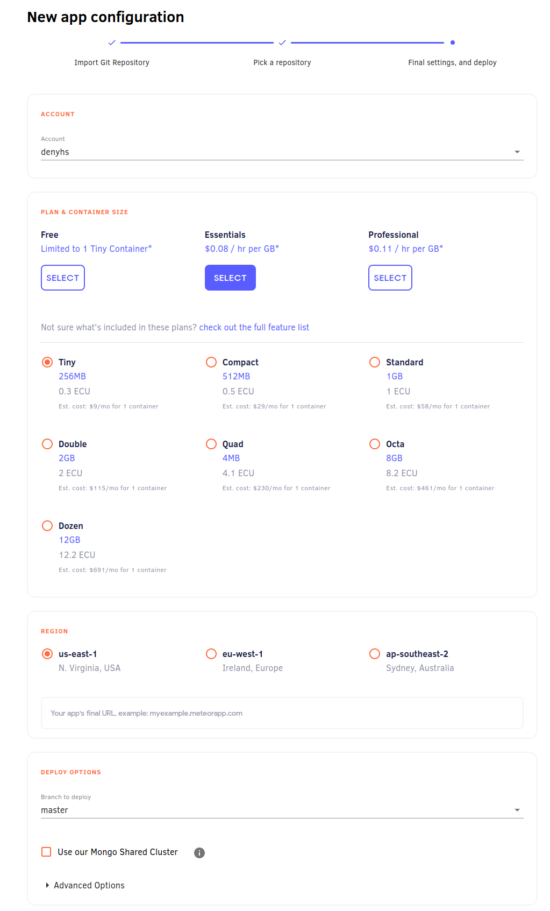

Galaxy makes it simple to deploy, scale, and monitor your apps. This guide will walk new users through deploying Meteor apps.

<h2 id="sign-up">Sign up for Meteor Cloud</h2>

You need a Meteor Cloud account in order to deploy your apps. If you don't have one yet, you can [sign up here](https://cloud.meteor.com/?isSignUp=true).

<h2 id="deploy-a-new-app">Deploy a new app</h2>

Start by going to your [Meteor Cloud account](https://cloud.meteor.com/). Then go to *Apps* > *Deploy new app*. Once there, you'll see this configuration page:

Go ahead and click on the GitHub button. An authentication popup, from GitHub, will show up. On this popup, you can choose the individual account or organization that you want to give us access to. You don't need to give access to all your repositories if you don't want to. Later you can go on GitHub and change your permissions to authorize more repositories.

> If you don't use GitHub, please let us know your favorite Git provider in the link below the GitHub button. 

After connecting to your git provider you'll automatically go to the second step. In the second step you need to chose your account from the git provider and then choose the repository where is the Meteor app that you want to deploy.

Now just click on *Next Step* and you'll get on the third and last step.

In this step you just need to configure the last details, so you can have your app deployed. Starting by the *Account* which defines to which Meteor Cloud account your app will be deployed to.

Then you get to select which *Plan* you want to use. You can check everything about the plans on our [pricing page](https://www.meteor.com/cloud#pricing-section).

> We do not recommend deploying production applications to the Free plan as it provides only a limited container which is turned off when your app is not being used.

The **Container Size** needs to be selected as well, for paid apps we recommend that you start from the Compact. You can change this at any time, just go to your app page on Galaxy and select a different size.

You also need to select a *Region*. This is really important and your database should be in the same region to avoid latency and slowness in your app.

Now is the time to choose your **hostname**, the domain of your app. If you are using the free plan you need to use `meteorapp.com` as the main domain, and you can choose only the subdomain. If you are using a paid plan you can use any domain you like. In this case, you also need to set up your DNS, learn how [here](https://cloud-guide.meteor.com/dns.html). 

In the **Deploy Options** section, you can choose which branch you'll use as your deploy branch. Every commit done on this branch will trigger a new deployment. 
In this section, you can also choose to use our shared [MongoDB Cluster](https://docs.meteor.com/commandline.html#meteordeploy). Make sure you are not using this shared database for production apps.

There is another section for **Advanced Options**, where you can configure these options:

- **Build Container RAM**: It defines how much memory you want to use to deploy your app.
- **Meteor Settings**: Your initial [app settings](https://cloud-guide.meteor.com/deploy-guide.html#settings-create) (in a JSON format) when deploying an app.
- **Root Directory**: Directory on your repository where the root of your Meteor app is.
- **Pre Deploy Command**: This is the command that you run to install the apps dependencies, usually being `meteor npm install --production`.
- **Deploy Arguments**: Some argument that you can provide to your [deploy command line](https://docs.meteor.com/commandline.html#meteordeploy).
- **Environment Variables**: You can, for example, specify the region where your app will be deployed to.

With all configured you just need to hit *Deploy App* and the first version of your app will be deployed!

> You need to have a GitHub repository with a Meteor project on it. The following Meteor versions are supported: `1.12.2`, `2.0.1`, ` 2.1.2`, `2.2.4`, `2.3.7`, and any version from `2.4.1` to the latest. Otherwise you are going to see an error in the logs of your app on Galaxy.
 
<h2 id="deploy-existing-app">Deploy an existing app</h2>

On the app details page you can click on the button *Set up push to deploy*.

The first two steps on this case are the same as deploying a new app. You will just have to connect your Git Provider, and then choose the repository.
For the last step, all you need to do is to make sure that everything is correct on the **Deploy Options** section. As the app is already deployed, all the other fields are already defined.

After configuring everything, in case you need to edit it, you can click the _Set up push to deploy_ button on the app details page.

<h2 id="edit-deploy-settings">Next auto deploy settings</h2>

After configuring Push to Deploy to an app, you can find in Galaxy, on the app version tab, the field `Next Auto Deploy Settings`. You can use this field to add [app settings](https://cloud-guide.meteor.com/deploy-guide.html#settings-create) for the next deploy.
So when you commit to the branch that you configured, these settings will be used. After using this field for the first time, these settings will be used every time for the next deploys. If you decide not to use it anymore you can just leave the field empty and save it.

<h2 id="deploy-cost">Cost</h2>

- **Free plan**: there is no cost for deploys, but it is limited to 10 deploys per month.
- **Essentials plan**: the cost is the amount of **times deploying** x **amount of GBs** of memory x **$0.08**.
- **Professional plan**: the cost is the amount of **times deploying** x **amount of GBs** of memory x **$0.11**.

So, for example, if you spend 15 minutes on deployments using 3GBs of memory for an app in the Essential plan.
The cost added to your invoice would be: **0.25h** x **3GBs** x **$0.08** = **$0.06**.

> If you want to use your own machines to build and deploy your apps, you can use the [command line](/deploy-setup.html).

<h2 id="after-set-up">FAQ</h2>

1 - **How to trigger new deploys?**

After you finish setting up everything, every commit you do to the chosen branch will trigger a new deploy. Also, every time you save the configuration a new deploy will be triggered.

2 - **Can I use the repository and branch to different apps?**

Yes, you can. So be careful when setting up your apps, so you don't deploy the wrong code to an app.

3 - **What happens if a new commit is pushed before the previous deploy is completed?**

The previous deploy will be canceled and the new one will start.

4 - **How I cancel a deploy that is in progress?**

You can't. At least for now the only way a deploy is cancelled is if a new commit arrives, or if the deploy fails.

5 - **What docker error 137 means?**

This error means there was an Out Of Memory error. To solve this you should increase the amount of memory you use to deploy your app. You can do this on the third step of the Push to Deploy screen, on the section *Deploy options* > *Build Container RAM*.

**Do you want to deploy from the command line? See the explanation [here](/deploy-guide.html).**
