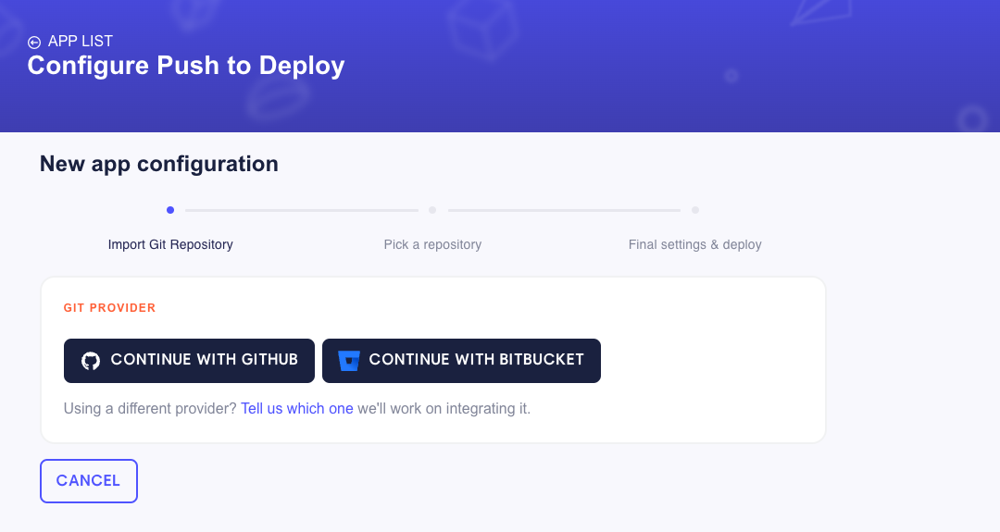
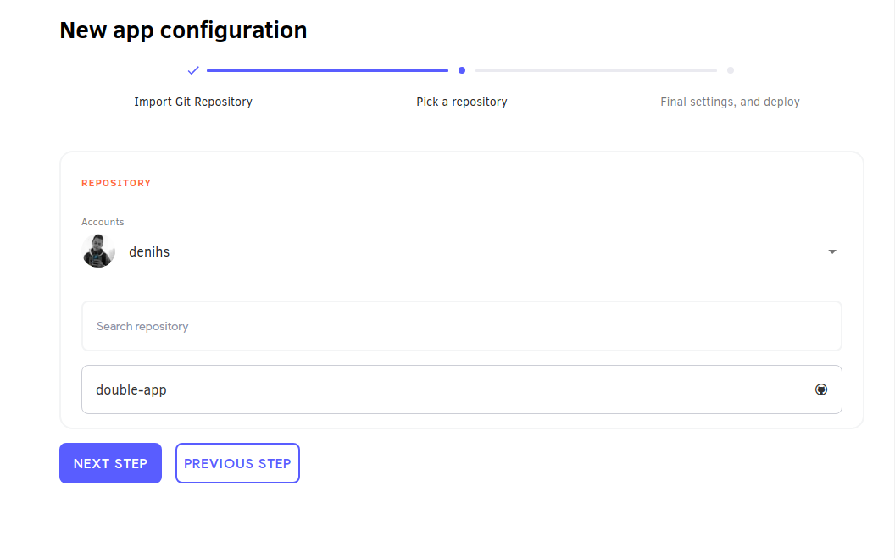
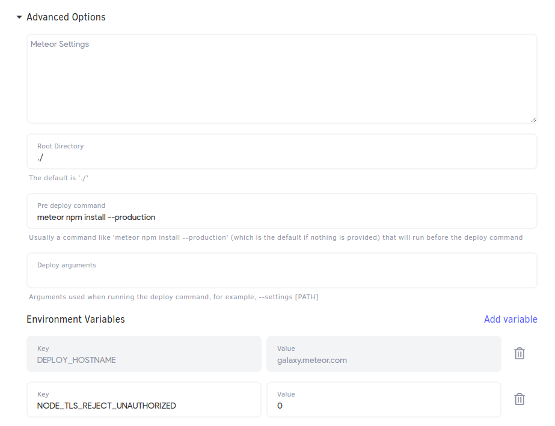
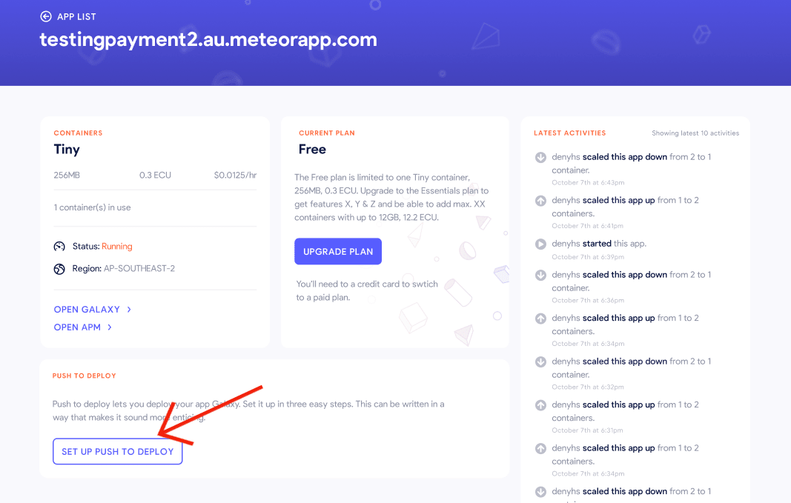

With this feature, never was easier to create an app on Galaxy. All you need to do is follow three  simple steps, then you'll have a new app deployed.

<h2 id="pre-requirements">Pre requirements</h2>

Today we have our integration just with GitHub. In the future we'll add more Git providers.

You need to have on GitHub a repository with a Meteor project on it. The following Meteor versions support this feature: `1.12.2`, `2.0.1`, ` 2.1.2`, `2.2.4`, `2.3.7`, and any version from `2.4.1` to the latest.

<h2 id="deploying-a-new-app">Deploying a new app</h2>

Start by going to your Cloud account [here](https://cloud.meteor.com/). Then go to *apps* > *Deploy a new app*. Once there, you'll see this page:

Go ahead and click on the GitHub button. An authentication popup, from GitHub, will show up. On this popup you can choose the individual account or organization that you want to give us access. You don't need to give access to all your repositories if you don't want to. Later you can go on GitHub and change your permissions to authorize more repositories.

After connecting to your git provider you'll automatically go to second step. On the second step you need to chose your account from the git provider and then choose the repository where is the Meteor app that you want to deploy.

Now just click on *NEXT STEP* and you'll get on the third and last step.

On the last step you'll just need to configure the last details, so you can have your app deployed. Starting by the *Account* which defines to which Cloud account your app will be deployed to.

Then you get to select which *Plan*, *Container Size*, and *Region* your app will have.

On the **Deploy Options** section, you can choose which branch you'll use as your deploy branch. Every commit done on this branch will trigger a deploy. On this section you also can opt to user or not our shared [MongoDB Cluster](https://docs.meteor.com/commandline.html#meteordeploy).

You also have *Advanced Options*. Here is a description of each one:

- **Meteor Settings**: You initial [app settings](https://cloud-guide.meteor.com/deploy-guide.html#settings-create) when deploying an app in a JSON format.
- **Root Directory**: Directory on your repository where the root of your Meteor app is.
- **Pre Deploy Command**: This is the command that you run to install the apps dependencies, usually being `meteor npm install --production`.
- **Deploy Arguments**: Some argument that you can provide to your [deploy command line](https://docs.meteor.com/commandline.html#meteordeploy). It shouldn't be necessary for most the cases.
- *Memory amount on deploy*: This defines how much memory you want to use to deploy your app.
- **Environment Variables**: Most common when deploying a Meteor app is `DEPLOY_HOSTNAME`, that you don't need to provide anymore.

Now with all configured you just need to hit **DEPLOY APP** and the first version of your app will be deployed!

<h2 id="setup-up-existing-app">Setting up Push To Deploy for existing app</h2>

On the app page details page you can click on the button `SET UP PUSH TO DEPLOY`.

The first two steps on this case are the same. You will just have to connect your Git Provider, and then choose the repository. For the last step you will have fewer options change. Basically all you need is to make sure everything is correct on the **Deploy Options** section. As the app is already deployed, all the other fields are already defined.

After all it's set up, you can edit it again buy clicking in button `CONFIGURE PUSH TO DEPLOY` in the app details page.

<h2 id="editing-deploy-settings">Editing next deploy settings</h2>

On Galaxy, in the app version tab, after configuring Push to Deploy to an app, you will find the field `Next Auto Deploy Settings`. Use this field to add [app settings](https://cloud-guide.meteor.com/deploy-guide.html#settings-create) for the next deploy. So when you do the commit to the branch that you configured, these are the settings that will be used. Once you use this field for the first time, the settings will be used every time for the next deploys. If you decide not to use it anymore you can just leave the field empty and save it. 

<h2 id="after-set-up">FAQ</h2>

1 - **How to trigger new deploys?** 

After you finish setting up everything, every commit you do to the chosen branch will trigger a new deploy. Also, every time you save the configuration a new deploy will be triggered.

2 - **Can I use the repository and branch to different apps?**

Yes, you can. So be careful when setting up your apps, so you don't deploy the wrong code to an app.

3 - **What happens if a new commit is pushed before the previous deploy is completed?**

The previous deploy will be canceled and the new one will start.

4 - *How I cancel a deploy that is in progress?*

You can't. At least for now the only way a deploy is cancelled is if a new commit arrives, or if the deploy fails.

5 - **What docker error 137 means?**

This error means there was an Out Of Memory error. To solve this you should increase the amount of memory you us to deploy your app. You can do this on the third step of the Push to Deploy screen, on the section *Deploy options* > *Advanced options* > *Memory amount on deploy*.
