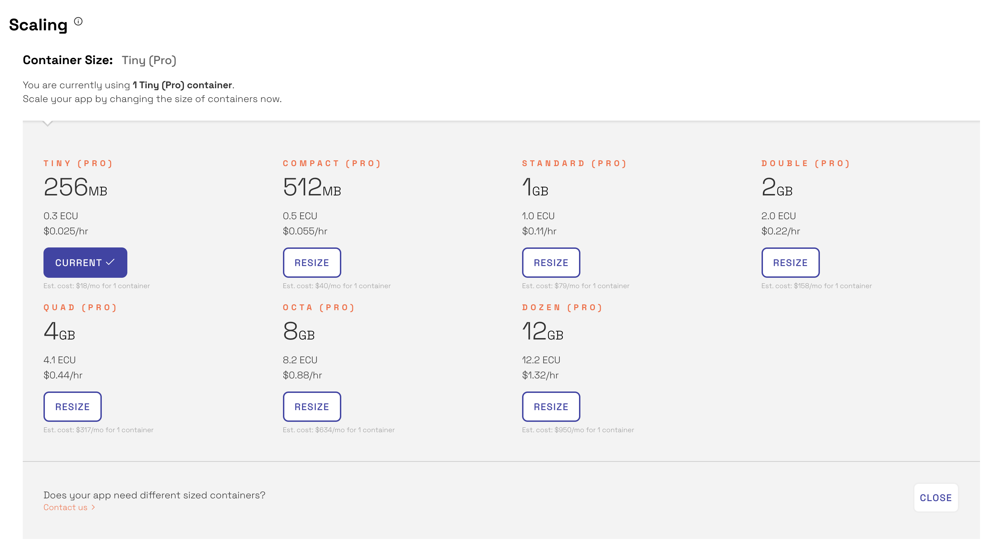

Scaling and sizing your application is specific to the architecture and performance characteristics of your app. As apps grow they often require more resources to perform well. Galaxy accommodates growth by offering vertical and horizontal resource scaling.

Scaling with Galaxy happens without downtime; your users will not experience service interruption, as long as you maintain at least one continuously running container at all times.

<h2 id="what-to-look-for">What to look for</h2>

We recommend that you scale when your app’s container usage exceeds either 70% memory, 80% CPU, or consistently spikes to 100% CPU. Use Galaxy’s performance graphs to track your resource usage over time. 

<h2 id="how-to">How to scale</h2>

By default, new applications are deployed to Compact containers. Compact containers are appropriate for small apps. For large codebases, we recommend that you run your app on Standard containers.

**Vertical scaling** increases your app's available resources by expanding the size of each container. Use this method of scaling when your app requires more CPU or RAM than the current container size can handle. If handling a single user/connection needs more memory/CPU than will fit in the currently used container size, you'll need to vertically scale, even if the usage doesn't last for long.

Consider changing your [garbage collection settings](#garbage-collection), to take full advantage of larger-sized containers.

Vertical scaling works best for one-time changes, when you won't need to change container sizes often. 

Vertical scaling restarts all your containers. If you adjust the container size of a container, that container will restart.

> Note that larger containers may take slightly longer to restart.

**Horizontal scaling** increases your app’s available resources by adding more containers. This is useful when sudden increases in usage or traffic cause your app to be less performant.

Horizontal scaling is recommended if you need to scale up and down, gradually and frequently.

A good rule of thumb is to use the smallest container size that can handle a single user's load, and scale horizontally beyond this.

> Horizontal scaling does not restart your containers.

<h2 id="garbage-collection">Garbage collection</h2>

You may need to change Node's garbage collection settings for optimal performance. Garbage collection, in this context, refers to automatic memory management. Memory occupied by objects that are no longer in use by your code will be freed up for general use within your container, though the required checks can come at a performance cost.

Node, the JavaScript engine that powers Meteor, has a powerful garbage collector which can be tuned via various command-line options. One of the most important knobs is the "max old space size" setting, which tells Node how much memory to allow the largest part of the memory heap to grow to. Node's default, in our environment, is to allow slightly over 1 GB (1400 MB) of memory for this space.

You can control this option (and more generally, any Node setting that can be controlled at the command-line) by setting the environment variable `$GALAXY_NODE_OPTIONS` in your [settings.json file](/deploy-setup.html#env-variables). The value of the --max-old-space-size flag is an integer number of megabytes. For example, to allow 2000MB for the old space size, set `GALAXY_NODE_OPTIONS` to `--max-old-space-size=2000`.  (We previously used the `NODE_OPTIONS` variable for this purpose, but Node 8 (in Meteor 1.6) uses that name for a similar purpose which does not allow the garbage collection parameters to be adjusted.)

Note that while this is generally the largest part of a Node process's memory usage, it does not control the Node process's entire memory footprint. Additionally, if your process forks other subprocesses, they will use their own memory within your container's memory limits.

Users of Double and Quad containers may want to set this flag higher than its default of 1400 MB to take full advantage of their container's memory.

Conversely, users of Standard and Compact containers may want to lower this setting to ensure that their Node processes do their best to collect enough garbage to stay inside their container limits.

We are currently investigating the best default values for each container type, in order to set defaults for our users. We welcome your <a href="https://support.portal.meteor.com/servicedesk/customer/portal/1/group/-1">feedback</a> as to what works best, in your own experience.

