We have four different plan levels to choose from, which fit many different use cases. Plans are app-based, in the same account you can have apps in different plans.

- Free
- Essentials
- Professional
- Enterprise

Deciding which plan best suits your needs will be based on features available for each plan, as well as the container sizes and usage needed for your app. You can learn more about them on the [billing page](/billing.html#billing-usage).

> Get 20% Discount! Our Savings Plan is a pricing model that offers a 20% discount in exchange for a one-year upfront payment.
> Click [here](/billing.html#savings-plan) to learn more.

On this page, we will show you step-by-step how to upgrade from one plan to another.

<h2 id="free-to-essentials">Free to Essentials Plan</h2>

Considering you already have an app created in the `Free plan`, signin into your account by acessing [https://cloud.meteor.com](https://cloud.meteor.com) and follow the steps below to upgrade to the `Essentials plan`.

> Upgrade to the Essential plan to get Unlimited Custom Domains, DDoS Mitigation, Prerender SEO Optimization, Activity Notifications, & more. Plus you can add as many containers as you need with up to 12GB and 12.2 ECU.

1- Click on `View App List` to list all the apps you have in your account. If you want to upgrade an app from an Organization click on `View Organizations`, locate the organization you want and click on `View Apps`.

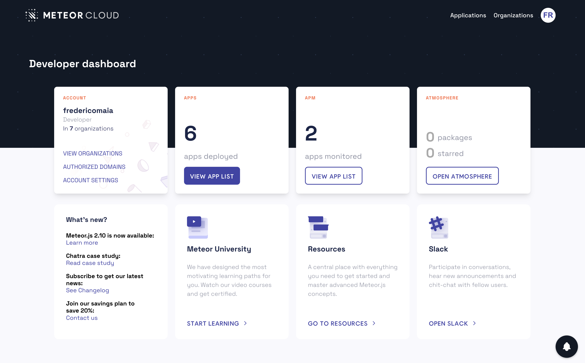

2- Locate the app from the list and click on `More Details`. In this example, I'm selecting the `react-starter.meteorapp.com` that is on the Free plan. You can also click directly on `Upgrade` on this page and skip to step 4.

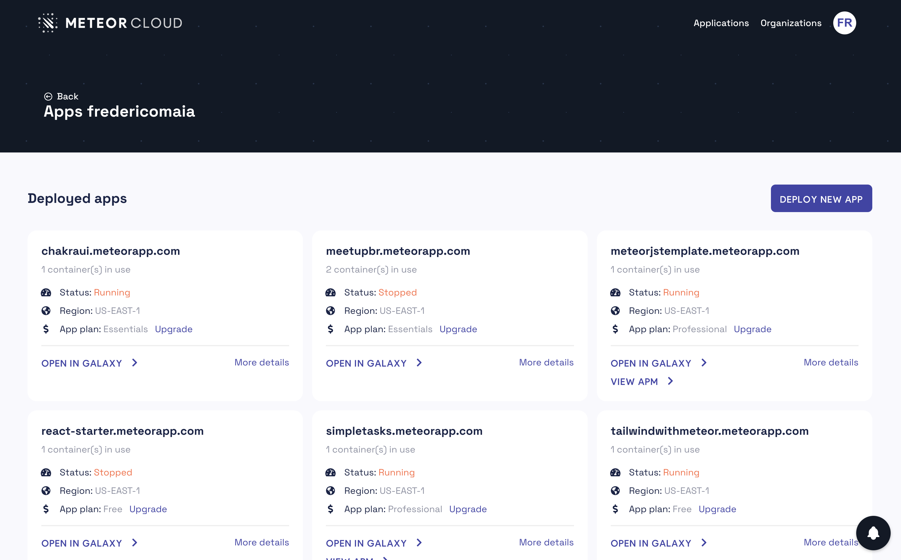

3- On this page, you can see your current plan and the features you will have access by upgrading from Free to Essentials Plan. Just click on `Upgrade Plan` to see the options available.

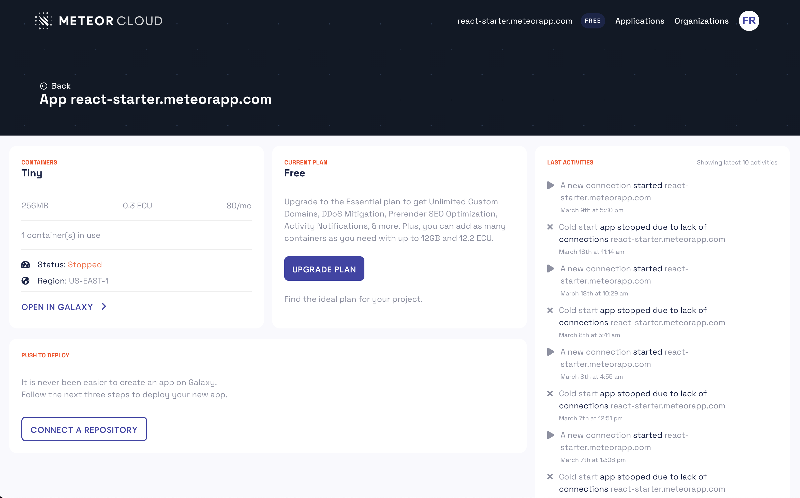

4- See the plan details, and click on `Go to Essential` to upgrade your app from Free to the Essentials plan.

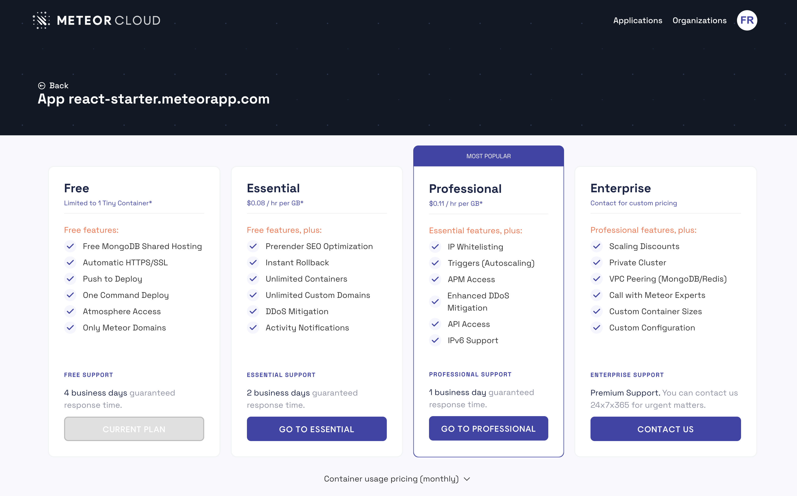

5- Confirm your choice by clicking on `Continue`.

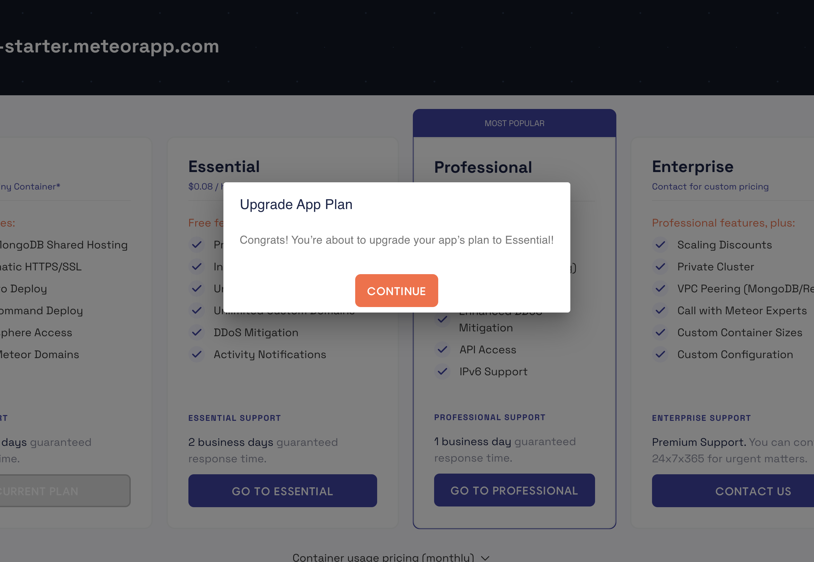

App upgraded with success! Click on `Stay on Dashboard` to go back to your app page.

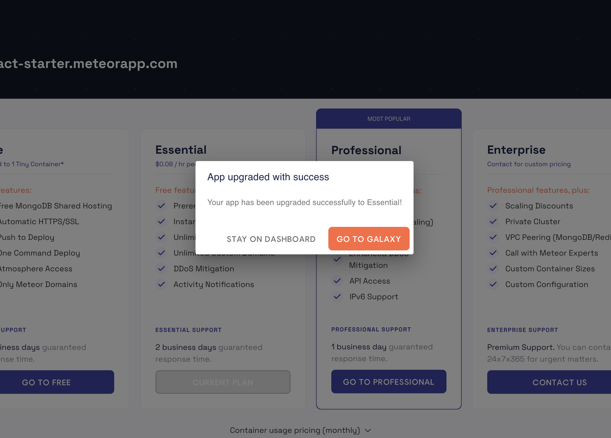

You can see that your current plan is now Essentials! Enjoy all the new features and if you want to take more advantage of Galaxy and take your app to the next level, you can upgrade your app from Essentials to the Professional Plan by reading this [step-by-step](/upgrade-app-plan.html#essentials-to-professional).

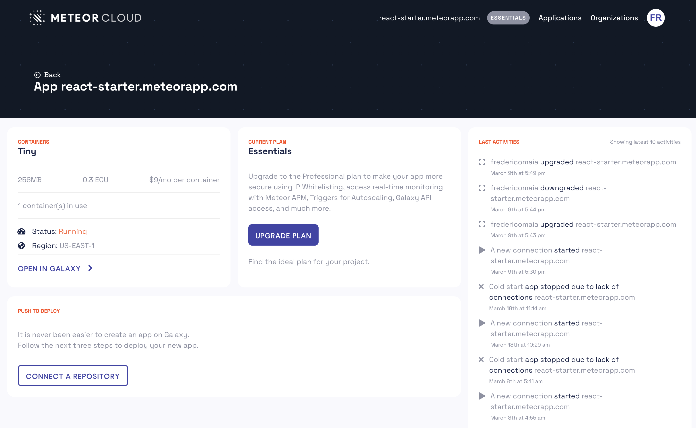

<h2 id="essentials-to-professional">Essentials to Professional Plan</h2>

Considering you already have an app created in the `Essentials plan`, signin into your account by acessing [https://cloud.meteor.com](https://cloud.meteor.com) and follow the steps below to upgrade to the `Professional plan`.

> Upgrade to the Professional plan to make your app more secure using IP Whitelisting, access real-time monitoring with Meteor APM, Triggers for Autoscaling, Galaxy API access, and much more.

1- Click on `View App List` to list all the apps you have in your account. If you want to upgrade an app from an Organization click on `View Organizations`, locate the organization you want and click on `View Apps`.

2- Locate the app from the list and click on `More Details`. In this example, I'm selecting the `react-starter.meteorapp.com` that is on the Essentials plan. You can also click directly on `Upgrade` on this page and skip to step 4.

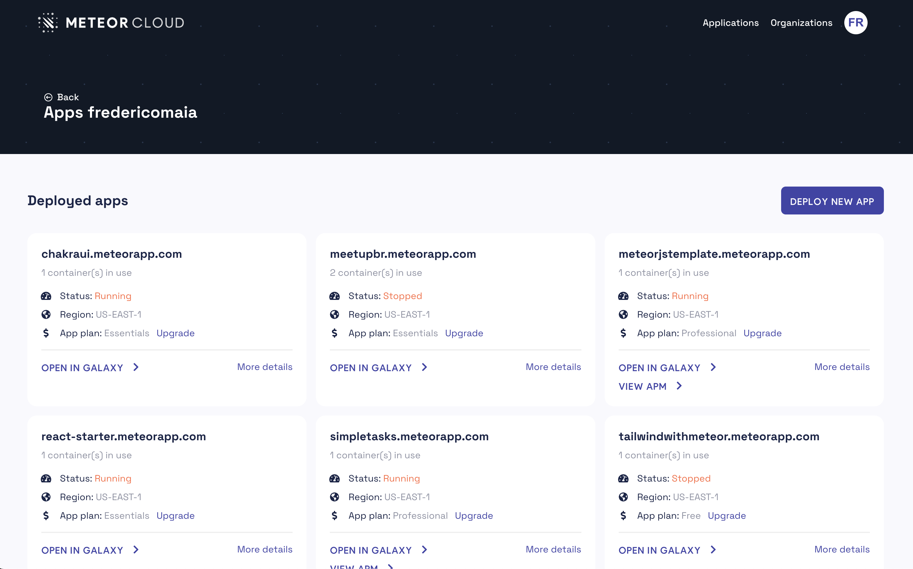

3- On this page, you can see your current plan and the features you will have access by upgrading from Essentials to Professional Plan. Just click on `Upgrade Plan` to see the options available.

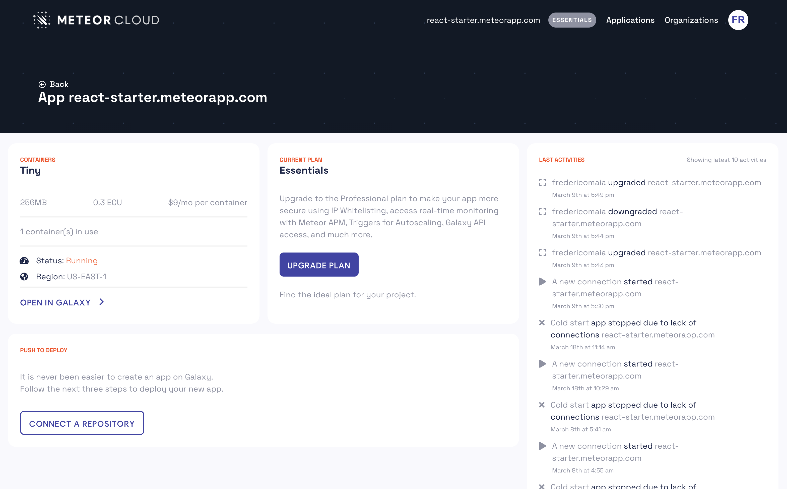

4- See the plan details, and click on `Go to Professional` to upgrade your app from Essentials to the Professional plan.

5- Confirm your choice by clicking on `Continue`.

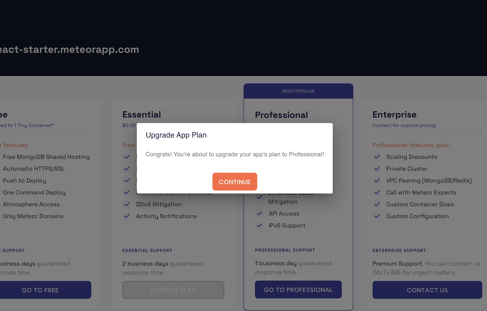

App upgraded with success! Click on `Stay on Dashboard` to go back to your app page.

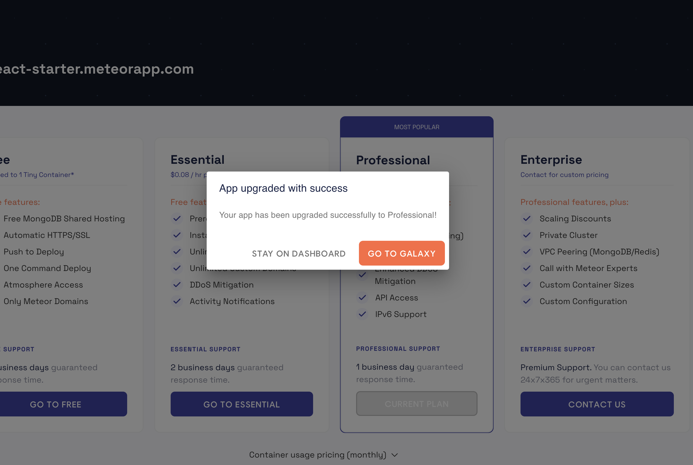

You can see that your current plan is now Professional. Enjoy all the new features!

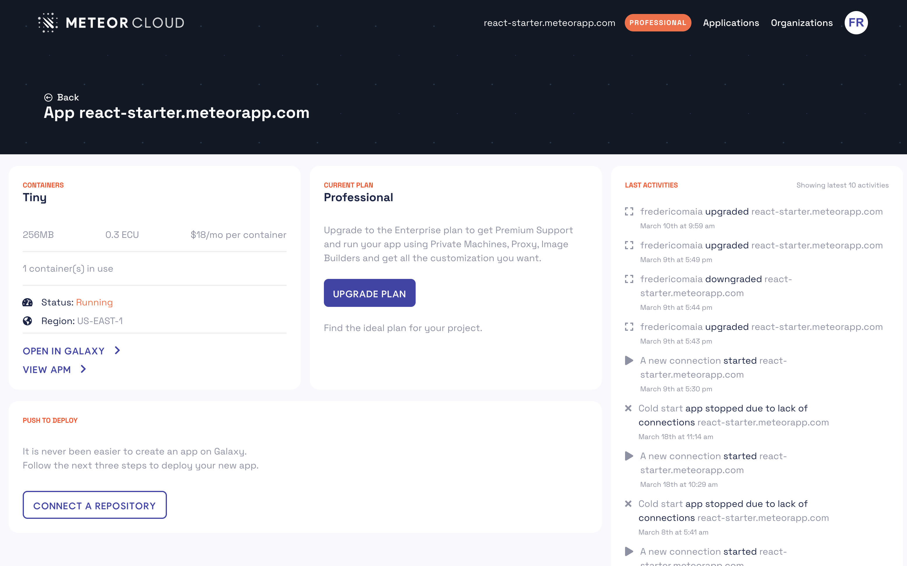

<h2 id="professional-to-enterprise">Professional to Enterprise Plan</h2>

The Enterprise plan enables you to have a custom infrastructure solution based on your needs. Built to help your team be more successful and stay focused on your product while our DevOps team takes care of an infrastructure built for you.

**Private Clusters and custom configuration:** you can have a private cluster on Galaxy, with private application machines with custom configuration, custom proxies, image builders, VPC Peering (MongoDB/Redis), and all the customization you need to run your business.

**Premium Support:** this would promote your support to the Enterprise level so that you could contact us 24/7/365 for urgent issues.

**Pricing:** the pricing is based on your needs. If we contact us, we can provide you with a rough estimate based on what we have charged customers lately.

To upgrade to the Enterprise plan, get in touch with us and inform us what your current needs are by accessing [this page](https://cloud.meteor.com/support/?type=enterprise) on Meteor Cloud. Or send an email to support@meteor.com.

<h2 id="upgrade-questions">Do you have questions?</h2>

We understand the hesitation to upgrade your app plan, but rest assured, we're here for you.

Let us ease your worries by answering any questions you may have so that you can make an informed decision.

Send an email to support@meteor.com, and we will be happy to help.
